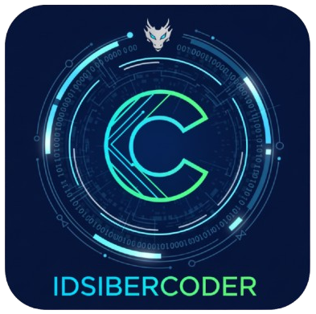

# IdSiberCoder - Your AI Coding Assistant in VS Code

**Your friendly AI teammate right inside VS Code**

## 🚀 What is IdSiberCoder?

IdSiberCoder is the VS Code extension that brings the power of AI directly into your editor. Think of it as having a smart coding partner who understands your workspace, explains their reasoning, and helps with daily coding tasks without ever leaving your project window.

## ✨ Key Features

### 🤖 **Smart AI Assistant**
- Chat naturally with your AI coding partner
- Choose between **DeepSeek**, **OpenAI**, **ZhiPu AI**, **Grok**, **Claude**, **Novita AI**, and **Google Gemini** models
- Get detailed explanations and reasoning

### 📁 **Workspace Aware**
- Read, edit, and manage files in your current project
- Safe file operations with built-in safeguards
- Automatic workspace context understanding

### 🛠️ **Powerful Tools**
- **Read files** - View any file in your workspace
- **Edit files** - Make precise changes with find/replace
- **Create files** - Write new files with AI-generated content
- **Move/Copy files** - Reorganize your project structure
- **List directories** - Explore your project folders
- **Execute CLI commands** - Run git, npm, yarn, and other safe commands directly from AI

### 💬 **Conversation Management**
- Multiple chat sessions
- Session history and persistence
- Easy switching between conversations
- Clean, organized chat interface

### ⚡ **Seamless Integration**
- Native VS Code sidebar integration
- VS Code theme compatibility
- Fast and responsive interface
- No external tools required

## 🎯 Quick Start

### Installation
1. Install from [VS Code Marketplace](https://marketplace.visualstudio.com/items?itemName=DatasiberLab.idsibercoder)
2. Or search for "IdSiberCoder" in VS Code Extensions

### First Time Setup
1. Open the IdSiberCoder sidebar (click the IdSiber icon in the Activity Bar)
2. Click the **🔑 API Keys** button in the panel header
3. Enter your API key for DeepSeek, OpenAI, ZhiPu AI, or Grok
4. Start chatting with your AI assistant!

## 🎮 How to Use

### Basic Chat
1. Open the IdSiberCoder sidebar
2. Type your question or request in the input field
3. Watch as your AI assistant responds and helps with your code

### File Operations
Ask your assistant to:
- "Read the main.js file"
- "Edit config.json to change the port to 3000"
- "Create a new component called Button"
- "List all files in the src directory"

### Session Management
- Use the sessions icon (📚) to manage conversations
- Create new sessions for different topics
- Switch between previous conversations
- Rename or delete old sessions

## 🎨 Interface Overview

### Sidebar Features
- **Chat History** - View your conversation timeline
- **Input Field** - Type your messages and requests
- **Model Selector** - Switch between AI providers (DeepSeek, OpenAI, ZhiPu AI, Grok, Claude, Novita AI, Google Gemini)
- **API Keys** - Manage your authentication
- **Session Manager** - Handle multiple conversations

### Welcome Screen
When you first open IdSiberCoder or start a new session, you'll see a friendly welcome screen with:
- Quick start tips
- Feature highlights
- Example prompts to get you started

## 🔧 Supported AI Providers

### DeepSeek
- DeepSeek Chat models
- Cost-effective and powerful
- Excellent for coding tasks

### OpenAI
- GPT-3.5, GPT-4, and other models
- Industry-leading AI capabilities
- Reliable and well-documented

### ZhiPu AI
- GLM-4.5-Flash and other GLM models
- High-performance Chinese language models
- Optimized for coding and reasoning tasks

### Grok
- Grok-3-Mini and other Grok models
- Advanced AI models with strong reasoning capabilities
- Optimized for complex problem-solving and coding assistance

### Claude
- Claude-3-7-Sonnet-Latest and other Claude models
- Anthropic's advanced AI with excellent reasoning capabilities
- Optimized for complex coding tasks and detailed explanations

### Novita AI
- DeepSeek models via Novita AI platform
- High-performance AI models with DeepSeek technology
- Optimized for coding tasks and technical assistance

### Google Gemini
- Google's advanced AI with strong reasoning and coding capabilities
- Optimized for complex problem-solving and technical assistance

## 💡 Pro Tips

### Best Practices
- **Be specific** - The more context you provide, the better the assistance
- **Use file paths** - Reference specific files for precise help
- **Break down tasks** - Complex problems work better as multiple smaller requests
- **Review changes** - Always check AI-generated code before committing

### Example Prompts
- "Can you help me debug this function? [paste code]"
- "What's the best way to structure this React component?"
- "Show me how to implement authentication in Node.js"
- "Optimize this database query for better performance"

## 🛠️ Requirements

- **VS Code** 1.60.0 or higher
- **API Key** for DeepSeek, OpenAI, ZhiPu AI, Grok, Claude, Novita AI, or Google Gemini
- **Internet Connection** for AI model access

## 🔒 Privacy & Security

- Your API keys are stored securely in VS Code's secret storage
- File operations only affect your current workspace
- No data is sent to external servers except for AI provider APIs
- All file operations include safety checks

## 🤝 Support & Community

### Getting Help
- Check the [developer documentation](README_DEVELOPER.md) for technical details
- Open an issue on our GitHub repository
- Contact support: candrapwr@datasiber.com

### Feedback & Suggestions
We're constantly improving IdSiberCoder! Your feedback helps us make it better:
- Feature requests
- Bug reports
- UI/UX suggestions
- Performance improvements

## 📝 License

This project is licensed under the MIT License - see the [LICENSE](LICENSE) file for details.

---

**Happy coding with your AI partner!** 🎉

*IdSiberCoder - Making coding more collaborative, one conversation at a time*

